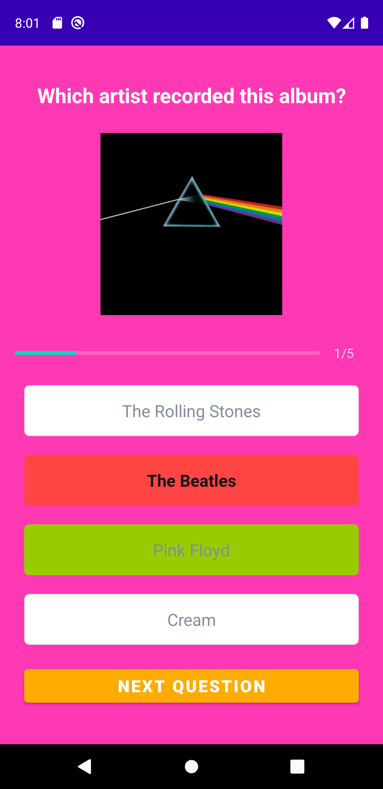
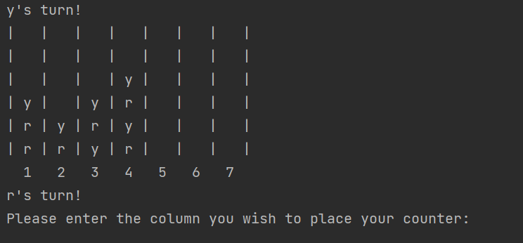

## About me

My name is Hannan and I am currently studying for an MSc in Computer Science. I have always had a love for technology and decided to take on a conversion Masters course after I finished my undergraduate degree in Chemistry as I knew I wanted to become a software engineer! Recently, I have really enjoyed having a go at Android app development in Java in my spare time alongside my studies.

### Skills

I have learnt the following languages:
- Python
- Java
- C
- Haskell

Additionally, I have experience working with Agile methodologies, particularly Scrum, in a team.

## Projects
### Music Quiz App

An album art music quiz made as a personal project in Android Studio with Java and XML.

Link: https://github.com/HannanDotCom/music_quiz_app

### Connect4

A basic Connect4 game created in Java for a course assignment, playable in CMD. 

Link: https://github.com/HannanDotCom/Connect4

### Sudoku Solver

 Created for a course assignment in Python - a sudoku solver that utilises constraint propagation and depth first search. 

Link: https://github.com/HannanDotCom/sudoku_solver

## Contact

GitHub: https://github.com/HannanDotCom

E-mail: helamriti@gmail.com
